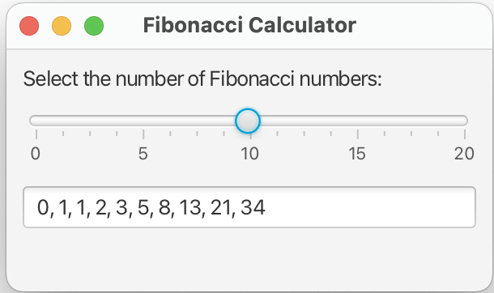

# Fibonacci Calculator Application
I created this simple Java application for a tutoring lesson that I held. The main purpose of the app is to show how recursion works.
It is a simple Fibonacci calculator implemented using JavaFx and it uses the Maven build system.

## Running the app
To start the application the FibonacciApp class has to be run.

